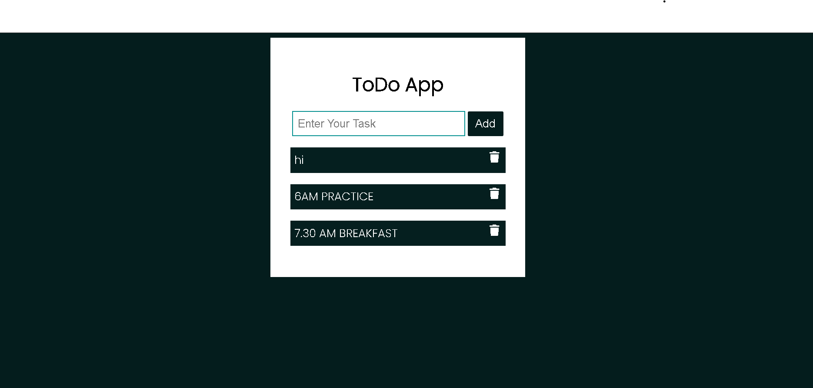

# TECH-A-INTERN
Level 2 - Completed 3 Task  in Web Development Internship @TECH-A-INTERN.

## Task 1
<h1 align="center" id="title">Weatherio</h1>

<h2>🚀 Demo</h2>

[weather-application-sooty.vercel.app](https://weather-application-steel-ten.vercel.app/#/current-location)

  
  
<h2>🧐 Features</h2>

Here're some of the project's best features:

*   Real-time Weather
*   Last 5 days forecast
*   Wind speed
*   Userfriendly
*   Suggestion while searching your location

  
## Task 2

<h1 align="center" id="title">Image Gallery</h1>

## Preview

<h2>🚀 Demo</h2>

[https://sujan5757.github.io/ImageGallery/](https://sujan5757.github.io/ImageGallery/)

## Task 3

<h1 align="center" id="title">To Do Page</h1>

<h2>🚀 Demo</h2>

[https://to-do-page-jyog.vercel.app/](https://to-do-page-jyog.vercel.app/)

<h2>💻 Built with</h2>

Technologies used in the project:

*   HTML5
*   CSS3
*   Javascript

<h2>🛡️ License:</h2>

This project is licensed under the MIT Licence
